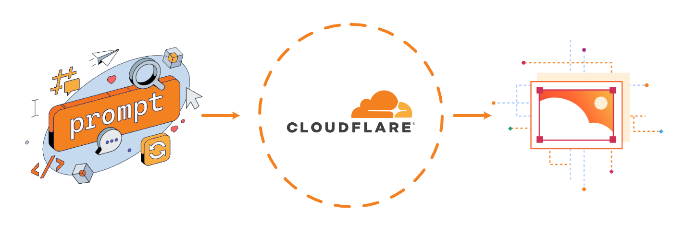

# Text to Image API on Cloudflare Workers 

A serverless **text-to-image generation API** built on [Cloudflare Workers AI](https://developers.cloudflare.com/workers-ai/). Generate images from text prompts using Stable Diffusion XL, SDXL-Lightning, DreamShaper, and FLUX.1 [schnell] — all from a single Worker, with API-key auth and zero infrastructure to manage.

<p  align="center"> 
	 
</p>

<p align="center">
  <a href="https://developers.cloudflare.com/workers-ai/"></a>
  
  
  
</p>

---

## Features

- **Multi-model**: SDXL, SDXL-Lightning (fast), DreamShaper (photoreal), FLUX.1 [schnell]
- **Simple root endpoint** — `POST /` with a `topic` field, returns a JPEG directly
- **API-key auth** — `Authorization: Bearer`, `x-api-key`, or `?api_key=` (timing-safe via Web Crypto)
- **Two output modes** — raw `image/jpeg` (streamed) or `application/json` (base64 + data URL)
- **GET and POST** both supported on `/v1/generate`
- **Env-configurable defaults** — model, width, height, steps, guidance, seed all overridable via env vars
- **CORS-enabled** out of the box — call it from any frontend
- **Observability enabled** — view logs and metrics in the Cloudflare dashboard
- **One file** of Worker code, no build step, no runtime npm bloat

---

## Available models

| Alias            | Model ID                                              | Best for                          |
|------------------|-------------------------------------------------------|-----------------------------------|
| `sdxl`           | `@cf/stabilityai/stable-diffusion-xl-base-1.0`        | High-quality general purpose      |
| `sdxl-lightning` | `@cf/bytedance/stable-diffusion-xl-lightning`         | Fast 1024px in ~4 steps           |
| `dreamshaper`    | `@cf/lykon/dreamshaper-8-lcm`                         | Photorealism                      |
| `flux-schnell`   | `@cf/black-forest-labs/flux-1-schnell`                | Fast, high quality (max 8 steps)  |

You can also pass any other Workers AI text-to-image model by its full `@cf/...` ID.

---

## Quick start

### 1. Install

```bash
git clone <this-repo>
cd cloudflare-api
npm install
```

### 2. Authenticate with Cloudflare

```bash
npx wrangler login
```

### 3. Set the API key

Production (encrypted secret on Cloudflare):

```bash
npx wrangler secret put API_KEY
# paste your key when prompted
```

Local dev — put it in `.dev.vars` (already gitignored):

```bash
cp .env.example .dev.vars
# edit .dev.vars and set API_KEY=your-local-dev-key
```

### 4. Run locally

> Workers AI **always runs remotely on Cloudflare's edge**, even via `wrangler dev`. Usage is billed against your Cloudflare account.

```bash
npm run dev
# → http://localhost:8787
```

### 5. Deploy

```bash
npm run deploy
# → https://stable-diffusion-api.<your-subdomain>.workers.dev
```

---

## Authentication

Every request to `/` and `/v1/generate` must include your API key in one of three places:

| Method                    | Example                           | Notes                                     |
|---------------------------|-----------------------------------|-------------------------------------------|
| `Authorization` header    | `Authorization: Bearer <key>`     | Preferred                                 |
| `x-api-key` header        | `x-api-key: <key>`                |                                           |
| `api_key` query parameter | `?api_key=<key>`                  | Useful for quick tests; avoid in logs     |

`/v1/models` is **public** (no auth needed).

---

## API reference

Base URL when deployed: `https://stable-diffusion-api.<subdomain>.workers.dev`
Base URL locally: `http://localhost:8787`

---

### `POST /`

The simple endpoint. Send a `topic` and get a JPEG back.

**Headers**: `Content-Type: application/json` + API key.

**Body**:

| Field    | Type   | Default        | Notes                              |
|----------|--------|----------------|------------------------------------|
| `topic`  | string | **required**   | What to generate. Up to 2048 chars |
| `model`  | string | server default | Alias or full `@cf/...` ID         |
| `width`  | int    | env default    | Image width in px                  |
| `height` | int    | env default    | Image height in px                 |

**Response**: raw `image/jpeg`.

```bash
curl --location 'https://yourdomain.com' \
  --header 'Content-Type: application/json' \
  --header 'Authorization: Bearer <your-api-key>' \
  --data '{
    "topic": "Create a F1 Car on the Moon",
    "width": 768,
    "height": 448
  }' \
  --output image.jpg
```

---

### `GET /v1/models`

Lists available model aliases, the configured default model, and active env defaults. **No auth required.**

```bash
curl http://localhost:8787/v1/models
```

```json
{
  "default": "@cf/stabilityai/stable-diffusion-xl-base-1.0",
  "aliases": {
    "sdxl":           "@cf/stabilityai/stable-diffusion-xl-base-1.0",
    "sdxl-lightning": "@cf/bytedance/stable-diffusion-xl-lightning",
    "dreamshaper":    "@cf/lykon/dreamshaper-8-lcm",
    "flux-schnell":   "@cf/black-forest-labs/flux-1-schnell"
  },
  "defaults": {
    "width": 1024,
    "height": 1024,
    "steps": 20,
    "guidance": 7.5,
    "seed": null
  }
}
```

---

### `POST /v1/generate`

Full-featured endpoint with all parameters and format options.

**Headers**: `Content-Type: application/json` + API key.

**Body**:

| Field             | Type    | Default        | Notes                                                        |
|-------------------|---------|----------------|--------------------------------------------------------------|
| `prompt`          | string  | **required**   | Up to 2048 chars                                             |
| `negative_prompt` | string  | —              | What to avoid                                                |
| `model`           | string  | server default | Alias from the table above or a full `@cf/...` ID           |
| `num_steps`       | int     | env default    | Max 20 (SDXL) / 8 (FLUX, auto-capped)                       |
| `width`           | int     | env default    | Image width in px                                            |
| `height`          | int     | env default    | Image height in px                                           |
| `guidance`        | number  | env default    | Prompt adherence; higher = more literal                      |
| `seed`            | int     | env default    | For reproducible results                                     |
| `strength`        | number  | 1              | (img2img only) 0–1                                           |
| `format`          | string  | `image`        | `image` → JPEG bytes, `json` → `{ image_base64, data_url }` |

**Response**: raw `image/jpeg` by default, or JSON if `format: "json"`.

### `GET /v1/generate?prompt=...`

Convenience GET form — all parameters as query strings. Returns a JPEG.

---

## Curl examples

> All examples assume `API_KEY` is exported: `export API_KEY=your-key`

### Simple topic-based generation (root endpoint)

```bash
curl --location 'http://localhost:8787' \
  --header 'Content-Type: application/json' \
  --header 'Authorization: Bearer $API_KEY' \
  --data '{"topic": "Create a F1 Car on the Moon", "width": 768, "height": 448}' \
  --output image.jpg
```

### Basic generation (save to file)

```bash
curl -X POST http://localhost:8787/v1/generate \
  -H "content-type: application/json" \
  -H "authorization: Bearer $API_KEY" \
  -d '{"prompt":"a red panda astronaut floating in space, ultra detailed"}' \
  --output out.jpg
```

### SDXL Lightning (fast — 4 steps)

```bash
curl -X POST http://localhost:8787/v1/generate \
  -H "content-type: application/json" \
  -H "authorization: Bearer $API_KEY" \
  -d '{
    "prompt": "a cyberpunk cat on a neon rooftop at night",
    "model": "sdxl-lightning",
    "num_steps": 4,
    "width": 1024,
    "height": 1024
  }' \
  --output cat.jpg
```

### FLUX.1 [schnell]

```bash
curl -X POST http://localhost:8787/v1/generate \
  -H "content-type: application/json" \
  -H "authorization: Bearer $API_KEY" \
  -d '{
    "prompt": "an art deco poster of a mountain sunrise",
    "model": "flux-schnell",
    "num_steps": 8
  }' \
  --output poster.jpg
```

### JSON output (base64 + data URL)

```bash
curl -X POST http://localhost:8787/v1/generate \
  -H "content-type: application/json" \
  -H "authorization: Bearer $API_KEY" \
  -d '{"prompt":"isometric pixel art of a tiny island","format":"json"}' | jq .
```

### Reproducible output (fixed seed)

```bash
curl -X POST http://localhost:8787/v1/generate \
  -H "content-type: application/json" \
  -H "authorization: Bearer $API_KEY" \
  -d '{"prompt":"a hot air balloon over Cappadocia","seed":42}' \
  --output balloon.jpg
```

### List available models (no auth)

```bash
curl http://localhost:8787/v1/models | jq .
```

---

## Environment variables

Set non-secret defaults in `wrangler.jsonc` under `"vars"`. All are optional — per-request params always take priority.

| Variable           | Type   | Description                                       |
|--------------------|--------|---------------------------------------------------|
| `API_KEY`          | secret | Required. Set via `wrangler secret put API_KEY`   |
| `DEFAULT_MODEL`    | var    | Model alias or full `@cf/...` path                |
| `DEFAULT_WIDTH`    | var    | Default image width in px                         |
| `DEFAULT_HEIGHT`   | var    | Default image height in px                        |
| `DEFAULT_STEPS`    | var    | Default inference steps                           |
| `DEFAULT_GUIDANCE` | var    | Default guidance scale                            |
| `DEFAULT_SEED`     | var    | Default seed (omit for random)                    |

Example `wrangler.jsonc`:

```jsonc
{
  "name": "stable-diffusion-api",
  "main": "src/index.mjs",
  "compatibility_date": "2026-05-01",
  "ai": { "binding": "AI" },
  "observability": { "enabled": true },
  "vars": {
    "DEFAULT_MODEL":    "@cf/stabilityai/stable-diffusion-xl-base-1.0",
    "DEFAULT_WIDTH":    "1024",
    "DEFAULT_HEIGHT":   "1024",
    "DEFAULT_STEPS":    "20",
    "DEFAULT_GUIDANCE": "7.5"
  }
}
```

---

## Wrangler command reference

### Development

| Command                        | What it does                                  |
|--------------------------------|-----------------------------------------------|
| `npx wrangler dev`             | Start local dev server (Workers AI is remote) |
| `npx wrangler dev --port 3000` | Use a custom port                             |
| `npx wrangler dev --remote`    | Run the Worker itself on the edge             |

### Deployment

| Command                         | What it does                   |
|---------------------------------|--------------------------------|
| `npx wrangler deploy`           | Deploy to production           |
| `npx wrangler deploy --dry-run` | Validate without uploading     |
| `npx wrangler deploy --minify`  | Deploy with minified output    |

### Secrets

| Command                              | What it does                               |
|--------------------------------------|--------------------------------------------|
| `npx wrangler secret put API_KEY`    | Set/rotate the API key (prompts securely)  |
| `npx wrangler secret list`           | List secret names                          |
| `npx wrangler secret delete API_KEY` | Remove the secret                          |

### Logs & observability

| Command                            | What it does               |
|------------------------------------|----------------------------|
| `npx wrangler tail`                | Stream live logs           |
| `npx wrangler tail --status error` | Errors only                |
| `npx wrangler tail --format json`  | JSON output (pipe to `jq`) |

### Versions & rollback

| Command                              | What it does                      |
|--------------------------------------|-----------------------------------|
| `npx wrangler versions list`         | Show recent deployed versions     |
| `npx wrangler rollback`              | Roll back to the previous version |
| `npx wrangler rollback <VERSION_ID>` | Roll back to a specific version   |

---

## Project layout

```
cloudflare-api/
├── src/
│   └── index.mjs       # Worker entrypoint — routes, auth, AI calls
├── wrangler.jsonc       # Worker config (AI binding, vars, compatibility date)
├── .env.example         # Example env vars (copy to .dev.vars for local dev)
├── package.json
└── README.md
```

---

## Troubleshooting

| Symptom                                            | Fix                                                                               |
|----------------------------------------------------|-----------------------------------------------------------------------------------|
| `401 Missing API key`                              | Send `Authorization: Bearer <key>` or `x-api-key: <key>`                          |
| `403 Invalid API key`                              | Key mismatch — re-run `npx wrangler secret put API_KEY`                           |
| `500 Server misconfigured: API_KEY secret not set` | Run `npx wrangler secret put API_KEY` (prod) or add `API_KEY=...` to `.dev.vars`  |
| `400 'topic' is required`                          | Use `"topic"` on `POST /`, or `"prompt"` on `POST /v1/generate`                   |
| `Unknown model` response                           | Use an alias from `/v1/models` or a full `@cf/...` model ID                       |
| Generation is slow                                 | Use `sdxl-lightning` or `flux-schnell` with `num_steps` 4–8                       |
| Local dev still bills me                           | Yes — Workers AI is always remote. Use a cheap model for dev                      |
| CORS errors from a frontend                        | Already handled; ensure your fetch sends `content-type: application/json`         |

---
